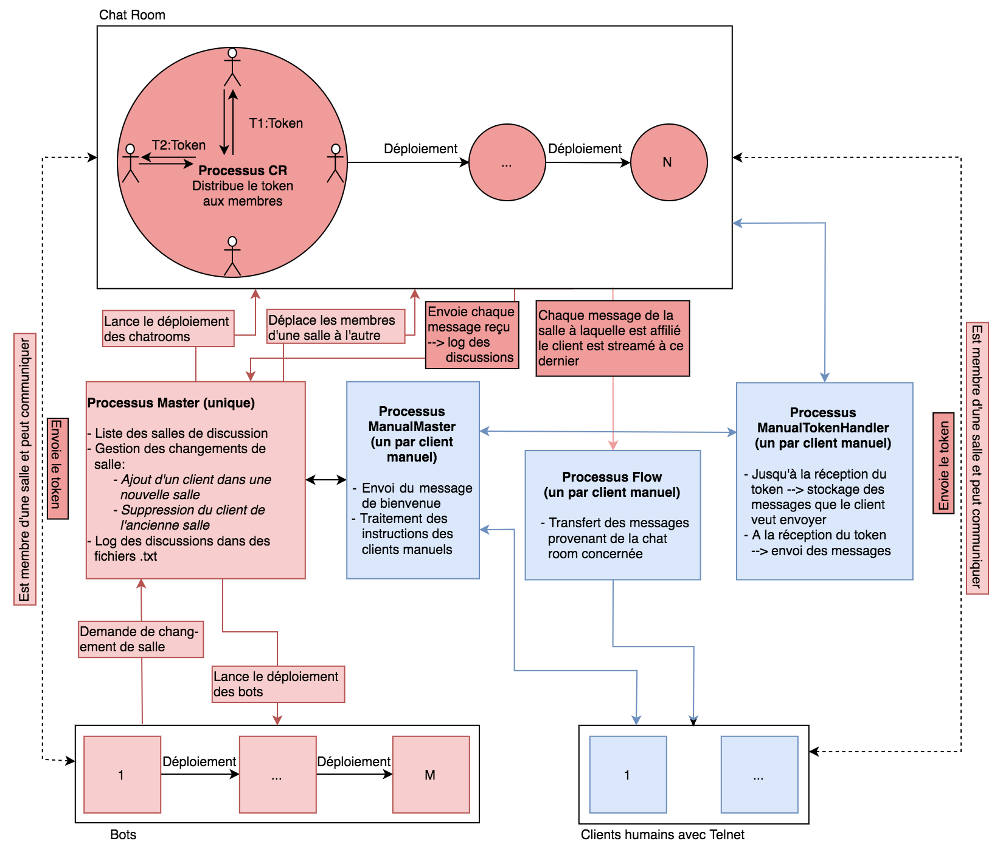

# Project description
This project is based on the distributed implementation of a chat room system.
The main challenge is to ensure a stable functioning of the system using mutual exclusion. Indeed, the number of queries can quickly become important since users have the opportunity to change chat rooms and interact together by sending and receiving messages. Therefore, it is essential that all requests are properly processed by maintaining a consistent order of arrival. To achieve this goal, the system makes use of the "token ring" architecture.

# Architecture

# Tests
In order to test the token system, different scenarios were evaluated:
* Launching the server with several bots within the same discussion, in order to check the order in which the bots speak and to observe that the token was indeed reset when all members had already spoken once.
* Launching the server with multiple bots and multiple rooms to control the proper functioning of the changement of rooms. Indeed, when a bot changes room,
he must return the token to the room and be deleted from the list of its members.
* In the previous scenarios, the discussions were completely simulated with bots. Therefore, this third test consisted of connecting human customers with Telnet and to place them within the discussions in order to check the following statements:
  - The connection between the server and the human client is correctly established.
  - The commands b. G_, C_, S_, P_, R_, Q_ work properly.
  - There must be no difference between a human customer and a bot: all customers must be treated the same way.
  - Live streaming of the discussion through the "Flow" process.
  - The human client's messages are placed in a queue if the message
    is sent when it is not in possession of the token and they are
    sent as soon as he receives it.

# Discussion
Here are the results of the various tests presented above:
* The bots speak one after the other and the token is well reset at every
trick. Thus, the discussion keeps a coherent order.
* Changes in the discussion room, no matter when they occur,
are completely transparent: the token continues to happen between the
different members of the salon.
* Human customers :
  - The TCP connection is working, the main menu is sent to anyone who tries to connect to the server.
  - All commands work
  - When a manual client is inserted into a chat room, the process ManualTokenHandler correctly handles the return of the token and outgoing messages on hold.
  - The Flow process does return the discussion instantly when one is in "R_" mode and keeps it in a buffer when "P_" mode is chosen. When you switch from "P_" to "R_" all the buffer is sent to the human client, which allows him to see the entire conversation.
* When the human client sends a message, it is only sent when he get the token. This is also valid when the user sends several messages in a row, without having received the token. 
